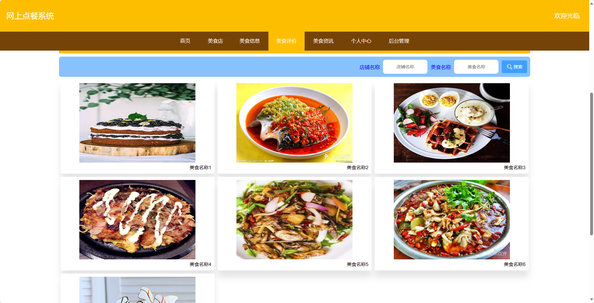
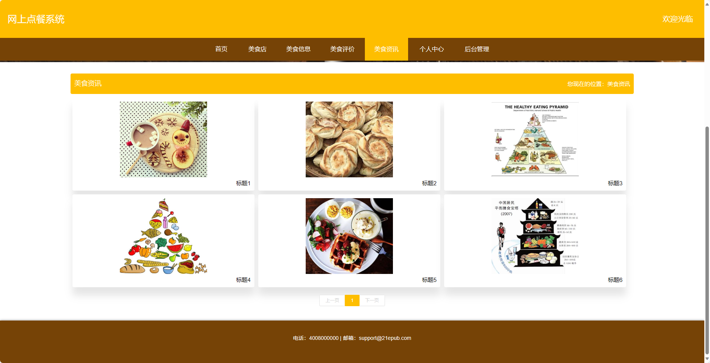
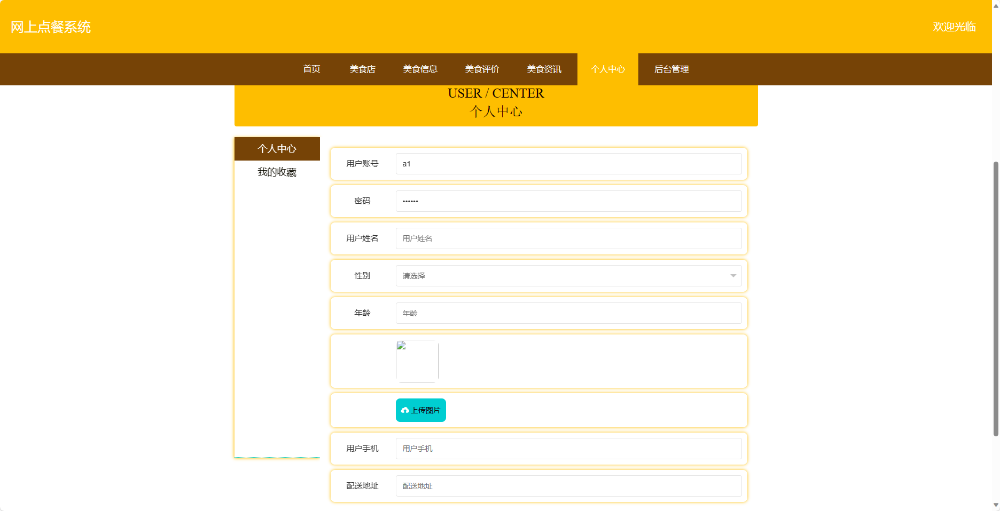

<h1 align="center">基于SpringBoot框架实现的网上点餐系统【带文档】</h1>

<h4> 完整代码获取地址：从戎源码网（https://armycodes.com/） </h4>
<h4> 作者微信：19941326836 QQ：605739993 QQ群：655392706 </h4>
<h4> 承接计算机毕设、Java毕业设计、Python毕业设计、深度学习、机器学习 </h4>
<h4> 选题+开题报告+任务书+程序定制+安装调试+论文+答辩ppt 一条龙服务 </h4>
<h4> 毕业设计所有选题地址：(https://github.com/Descartes007/allProject) </h4>

## 项目介绍

基于SpringBoot框架实现的网上点餐系统【带文档】：前端 vue、axios、elementui，后端 springboot、mybatis，系统角色分为：管理员、美食店和用户，管理员在管理后台用户信息、美食店管理、美食评价管理等；美食店可以对评论管理、美食信息管理等；用户可以购买美食等。主要功能如下：

## 【前台】

- 首页：展示系统的概要信息和热门推荐。
- 美食店：展示各个美食店的信息，包括店名、地址、联系方式等。
- 美食信息：展示美食的详细信息，包括菜品名称、价格、口味等。
- 美食评价：用户可以对美食进行评价和评论。
- 美食资讯：提供用户美食相关的资讯和新闻。
- 个人中心：用户可以查看个人信息、修改密码等操作。

## 【后台】
### 管理员

- 管理员个人中心：管理员可以查看个人信息、修改密码等操作。
- 用户管理：管理员可以管理系统中的用户，包括查看用户信息、禁用用户等。
- 美食店管理：管理员可以管理美食店的信息，包括添加、删除、修改店铺信息。
- 美食分类管理：管理员可以对美食进行分类管理，包括添加、删除、修改分类信息。
- 美食信息管理：管理员可以管理美食的详细信息，包括添加、删除、修改美食信息。
- 美食订单管理：管理员可以管理美食的订单信息，包括查看订单、取消订单等。
- 美食评价管理：管理员可以管理美食的评价信息，包括查看评价、删除评价等。
- 系统管理：管理员可以管理系统的一些配置参数。

### 美食店

- 个人中心：美食店可以查看自己的信息、修改密码等操作。
- 美食信息管理：美食店可以管理自己所提供的美食信息，包括添加、删除、修改美食信息。
- 美食订单管理：美食店可以查看自己店铺的美食订单信息，包括订单状态、接单情况等。
- 美食评价管理：美食店可以查看用户对自己店铺的评价和评论。

### 用户

- 个人中心：用户可以查看个人信息、修改密码等操作。
- 美食订单管理：用户可以查看自己的美食订单信息，包括订单状态、付款情况等。
- 美食评价管理：用户可以对已消费过的美食进行评价和评论。
- 我的收藏管理：用户可以管理自己收藏的美食店和美食信息。

## 环境

- <b>IntelliJ IDEA 2020.3</b>

- <b>Mysql 5.7.26</b>

- <b>Maven 3.6.3</b>

- <b>JDK 1.8</b>

## 运行截图

